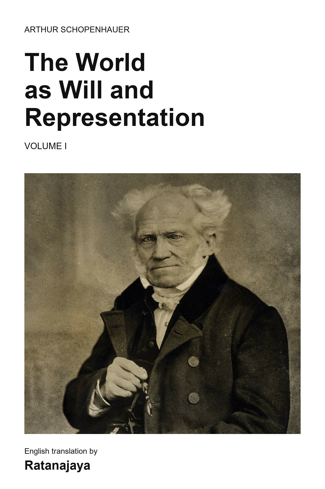

# The World as Will and Representation — Volume I

**[Download from GitHub Releases](https://github.com/ratanajaya/SchopenhauerTranslation/releases)** · **[Download the EPUB in this repository](dist/the-world-as-will-and-representation-volume-i.epub)**

Arthur Schopenhauer's account of the world as representation and will explores knowledge, nature, art, suffering, and ethics. This modern English reading edition includes the four books, §§1–71, the prefaces, and the appendix *Critique of Kantian Philosophy*.

**English translation by Ratanajaya**, with AI assistance from **OpenAI GPT-5.5** and **GPT-6 Sol**. The translation follows Eduard Grisebach's German edition (Leipzig: Philipp Reclam jun., 1892), preserving philosophical distinctions, footnotes, and original-language quotations beside English renderings.

The EPUB includes a photographic cover, linked contents and notes, and edition credits. It is intended for reading and study; it is not a new critical edition. The author's historical prejudices are retained and contextualized. See the [editorial review and corrections](_docs/human_review_notes.md) for the source checks behind this release.

The translation, original editorial material, and cover layout are **CC BY 4.0**; see [the licensing statement](LICENSE.txt). Cover photograph: **J. Schäfer, March 1859**, via [Wikimedia Commons](https://commons.wikimedia.org/wiki/File:Arthur_Schopenhauer_by_J_Sch%C3%A4fer,_1859.jpg), identified there as public domain.
